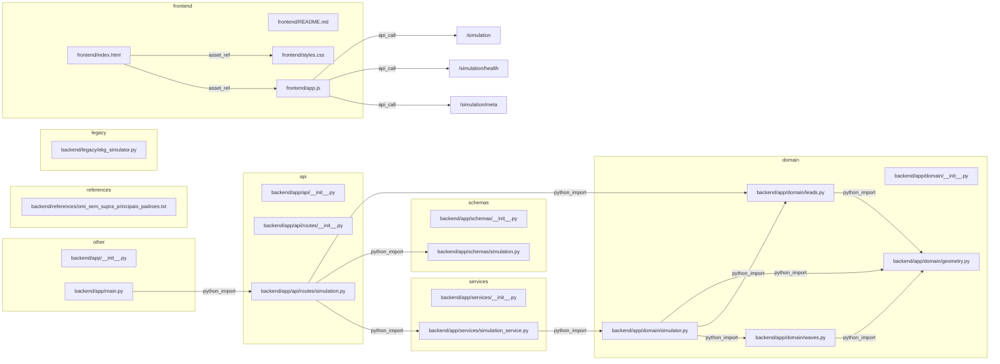

# Project Map: EKG Simulator

## Entrypoints
- `backend/app/main.py`
- `frontend/index.html`
- `frontend/app.js`

## Tree
```text
EKG Simulator
├── backend
│   ├── app
│   │   ├── api
│   │   │   ├── routes
│   │   │   │   ├── __init__.py
│   │   │   │   └── simulation.py
│   │   │   └── __init__.py
│   │   ├── domain
│   │   │   ├── __init__.py
│   │   │   ├── geometry.py
│   │   │   ├── leads.py
│   │   │   ├── simulator.py
│   │   │   └── waves.py
│   │   ├── schemas
│   │   │   ├── __init__.py
│   │   │   └── simulation.py
│   │   ├── services
│   │   │   ├── __init__.py
│   │   │   └── simulation_service.py
│   │   ├── __init__.py
│   │   └── main.py
│   ├── legacy
│   │   └── ekg_simulator.py
│   ├── references
│   │   └── omi_sem_supra_principais_padroes.txt
│   └── README.md
├── frontend
│   ├── app.js
│   ├── index.html
│   ├── README.md
│   └── styles.css
├── scripts
│   └── project_map.py
├── .gitignore
├── AGENTS.md
├── PROJECT_MAP.md
├── README.md
└── requirements.txt
```

## Layers
### frontend
- `frontend/README.md`
- `frontend/app.js`
- `frontend/index.html`
- `frontend/styles.css`

### api
- `backend/app/api/__init__.py`
- `backend/app/api/routes/__init__.py`
- `backend/app/api/routes/simulation.py`

### services
- `backend/app/services/__init__.py`
- `backend/app/services/simulation_service.py`

### domain
- `backend/app/domain/__init__.py`
- `backend/app/domain/geometry.py`
- `backend/app/domain/leads.py`
- `backend/app/domain/simulator.py`
- `backend/app/domain/waves.py`

### schemas
- `backend/app/schemas/__init__.py`
- `backend/app/schemas/simulation.py`

### references
- `backend/references/omi_sem_supra_principais_padroes.txt`

### legacy
- `backend/legacy/ekg_simulator.py`

### tooling_docs
- `AGENTS.md`
- `README.md`
- `backend/README.md`

### other
- `PROJECT_MAP.md`
- `backend/app/__init__.py`
- `backend/app/main.py`
- `requirements.txt`
- `scripts/project_map.py`

## Mermaid


## Files
- `AGENTS.md` [md] tags: agent_context
- `PROJECT_MAP.md` [md] tags: -
- `README.md` [md] tags: -
- `backend/README.md` [md] tags: -
- `backend/app/__init__.py` [py] tags: -
- `backend/app/api/__init__.py` [py] tags: -
- `backend/app/api/routes/__init__.py` [py] tags: -
- `backend/app/api/routes/simulation.py` [py] tags: api_route
- `backend/app/domain/__init__.py` [py] tags: domain_logic
- `backend/app/domain/geometry.py` [py] tags: domain_logic
- `backend/app/domain/leads.py` [py] tags: domain_logic
- `backend/app/domain/simulator.py` [py] tags: domain_logic
- `backend/app/domain/waves.py` [py] tags: domain_logic
- `backend/app/main.py` [py] tags: entrypoint, fastapi, serves_frontend
- `backend/app/schemas/__init__.py` [py] tags: schema
- `backend/app/schemas/simulation.py` [py] tags: api_route
- `backend/app/services/__init__.py` [py] tags: service
- `backend/app/services/simulation_service.py` [py] tags: service
- `backend/legacy/ekg_simulator.py` [py] tags: legacy
- `backend/references/omi_sem_supra_principais_padroes.txt` [txt] tags: reference
- `frontend/README.md` [md] tags: frontend
- `frontend/app.js` [js] tags: frontend
- `frontend/index.html` [html] tags: frontend
- `frontend/styles.css` [css] tags: frontend
- `requirements.txt` [txt] tags: -
- `scripts/project_map.py` [py] tags: -

## Relationships
- `backend/app/api/routes/simulation.py` -> `backend/app/domain/leads.py` [python_import]  (from ...domain.leads)
- `backend/app/api/routes/simulation.py` -> `backend/app/schemas/simulation.py` [python_import]  (from ...schemas.simulation)
- `backend/app/api/routes/simulation.py` -> `backend/app/services/simulation_service.py` [python_import]  (from ...services.simulation_service)
- `backend/app/domain/leads.py` -> `backend/app/domain/geometry.py` [python_import]  (from .geometry)
- `backend/app/domain/simulator.py` -> `backend/app/domain/geometry.py` [python_import]  (from .geometry)
- `backend/app/domain/simulator.py` -> `backend/app/domain/leads.py` [python_import]  (from .leads)
- `backend/app/domain/simulator.py` -> `backend/app/domain/waves.py` [python_import]  (from .waves)
- `backend/app/domain/waves.py` -> `backend/app/domain/geometry.py` [python_import]  (from .geometry)
- `backend/app/main.py` -> `backend/app/api/routes/simulation.py` [python_import]  (from .api.routes.simulation)
- `backend/app/main.py` -> `frontend/` [serves_directory]  (FRONTEND_DIR)
- `backend/app/services/simulation_service.py` -> `backend/app/domain/simulator.py` [python_import]  (from ..domain.simulator)
- `frontend/app.js` -> `/simulation` [api_call]  (fetch)
- `frontend/app.js` -> `/simulation/health` [api_call]  (fetch)
- `frontend/app.js` -> `/simulation/meta` [api_call]  (fetch)
- `frontend/index.html` -> `frontend/styles.css` [asset_ref]  (/app/styles.css)
- `frontend/index.html` -> `frontend/app.js` [asset_ref]  (/app/app.js)
- `requirements.txt` -> `numpy` [dependency]  (requirements)
- `requirements.txt` -> `plotly` [dependency]  (requirements)
- `requirements.txt` -> `matplotlib` [dependency]  (requirements)
- `requirements.txt` -> `ipywidgets` [dependency]  (requirements)
- `requirements.txt` -> `ipython` [dependency]  (requirements)
- `requirements.txt` -> `fastapi` [dependency]  (requirements)
- `requirements.txt` -> `uvicorn` [dependency]  (requirements)
- `requirements.txt` -> `pydantic` [dependency]  (requirements)
- `scripts/project_map.py` -> `(dynamic file access)` [file_io_hint]  (path.read_text(encoding='utf-8'))
- `scripts/project_map.py` -> `(dynamic file access)` [file_io_hint]  (path.read_text(encoding='utf-8'))
- `scripts/project_map.py` -> `(dynamic file access)` [file_io_hint]  (path.read_text(encoding='utf-8'))
- `scripts/project_map.py` -> `(dynamic file access)` [file_io_hint]  (path.read_text(encoding='utf-8'))